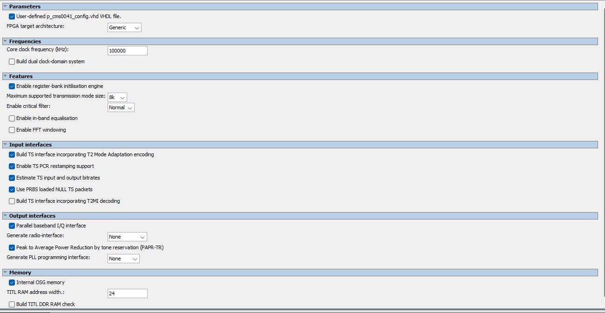
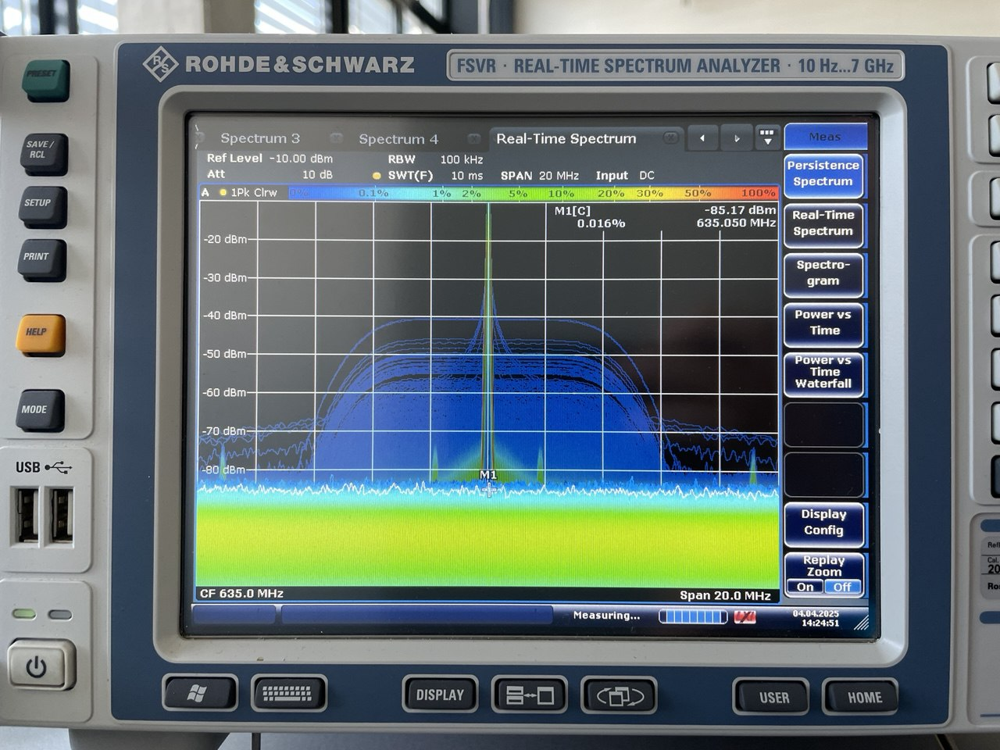
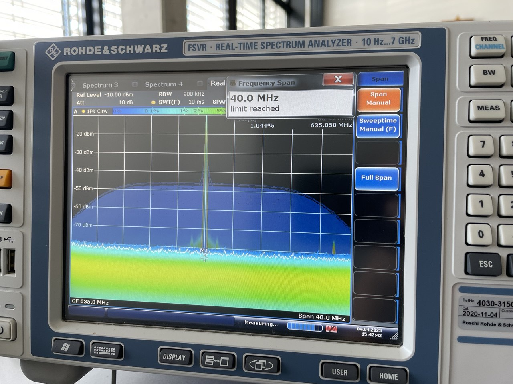
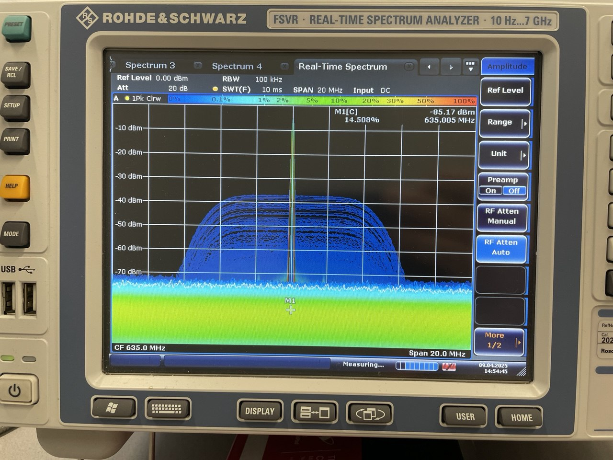
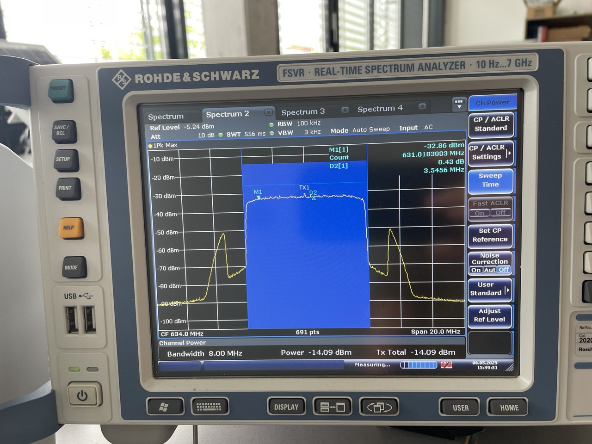

## Hardware design

### Commsonic

Need to specify how to feed data through Transport Stream interface. Commsonic IP core clock schould be minimum 69MHz since we're in 4k/8k max fft size and internal fft RAM config. See p.14 of s00080 datasheet. Raspberry pi SPI clock frequency could go up to 50MHz but it wouldn't keep up with the IP core.

### Copy Analog Device ADALM PLUTO

Using an SoC ARM cortex A9.

Comparison to a raspberry pi 4b:
	- Broadcom BCM2711, Quad core Cortex-A72 (ARM v8) 64-bit SoC @ 1.8GHz
	- Single-core ARM® Cortex™-A9 MPCore™ 667 MHz
#### Other analog device related stuff

Install adalm pluto drivers : [https://wiki.analog.com/university/tools/pluto/drivers/linux](https://wiki.analog.com/university/tools/pluto/drivers/linux)

Made some performance test from host to ADALM PLUTO

## Synthesize bladeRF

BladeRF can be synthetize using the script and the README.md file. Howeverr to synthetize for a bladeRF-micro you need to do the following:

- Make sure the repo has been cloned recursively.
- Go to [bladeRF/thirdparty/analogdevicesinc/no-OS]() and checkout to 0bba46e commit.
- Transform the following in [bladeRF/hdl/fpga/ip/analogdevicesinc/no_OS/CMakeLists.txt]()

```
        COMMAND ${Patcher_EXECUTABLE} -p3
to:
        COMMAND ${Patcher_EXECUTABLE} -p3 --binary -l
```

### Adapt to cyclone 10

The system_pll and fx3_pll needs to be regenerated for cyclone 10. Choose the altpll ip core for both.

Settings are:
system_pll => 38.4MHz input, 1 output 80MHz with a locked output
fx3_pll => 100MHz input, 1 output 100MHz with a locked output

Change both pll in the top design => entity work.<pll_name>

Add both .qip pll to the projects files.

Then change the .qsf file since fitter accept to compile the project (just comment out lines making error).

### Implement Commsonic DVB-T2 IP core inside BladeRF FPGA logic

Installing the commsonic folder to C:\intelFPGA\17.1\ip

For the license specify the floating license of the school with '<'port>@'<'hostname> and the commsonic file local location separated with a ";" character. The commsonic file must only contain the FEATURE paragraphe. Next time be aware to give the host NIC ID in the license setup window => the first number appearing in the Network interface Card field.

Include all the vhd submodule and top level vhd files.

To install the usb blaster driver letting dev program the cyclone V with a time_limited .sof file. The dev needs to turn off memory integrity feature located under core isolation in device security parameter. The he can install the driver located under the intelFPGA/17.1/quartus/driver/

In order to flash the board correctly. You need to get the rbf bitstream on this website https://www.nuand.com/fpga_images/ and load it first into the fpga using the ```bladeRF-cli -L path_to_rbf_file```commande. This command will load the bitstream into the fpga flash memory once and allow us to use quartus programmer to flash our custom .sof file. User need to launch the bladeRF-cli in interactive mode to have the fpga logic running.

### Trouble having output using only TS interface
Sending data through fx3 USB doesn't give anything on the output baseband_i and q of the T2 core. 

Then I try using the vhdl code given in the documentation. This code start the packet with the starting byte and then pads it with null byte in order to complete the 188byte packet. Still get 0 on output.

Tried measuring the tx_clock used for the ts_data_clock => get ~61MHz and signal seems OK (I was measuring wrong on the signal tap because the sample frequency wasn't high enough => Nyquist).

In the IP core component editor, we can configure clock frequency of the T2 core. By default, the frequency is 100MHz. I tried to change the core clock freq to fx3_pclk_clk instead of tx_clock since tx_clock is 60MHz. But I didn't get anything on the output.

#### SOLUTION
Commsonic gaves us a config file p_cms0041_config.vhd which contains the commands to init the core properly and outputing data. Which means the TS interface don't need to be wired to anything. We must set "Enable register-bank initialisation engine" in the T2 core component editor GUI.

They also gaves us a blockRAM VHDL implementation which will be wired to the TITL DDR RAM interface. This RAM is working at the same clocking frequency than the core which is 100MHz.The blockRAM VHDL component is described here [blockRAM.vhd](../hdl/quartus/work/bladerf-micro-A9-dvbt2/blockRAM/blockRAM.vhd)

Since we don't use external RAM for the OSG interface (in charge of the fft), we need to set the "Internal OSG memory" option in the T2 core component editor GUI. This means we need to had a secondary clock to the T2 component (clock_x2) that has twice the frequency of the main clock frequency of the core.



Now something is coming out the T2 I/Q output.

### Adapting the TS interface to the data FIFO

#### Fifo reader behavior 

fifo-current <= fifo.futur

1st step (unpacking): 
- Return a de type fifo-fsm_t sample stream-t type that contains data_i, datang and data_v (for validation) 
- This fct unpack a big std_logic_vector into the sample_stream_t like so:


- Then it fills the out_sample_t field of the fifo_future record

2nd step is checking in which state the fifo_current is :

- CASE compute enabled channel:

1. Just count off both channels which ones does have the in_sample_control(x).enable_to_high
2. Update fifo_future_enabled_channels
3. Update fifo_future_state to COMPUTE_OFFSET

- CASE compute offset

1. Init the starting index based on which channel are enabled
2. CH0=0 & CH1=1 if both are enabled  
else  
CH0=0 & CH1=0
3. Stores the index in fifo_future.ch_offsets
4. Update the actual number of valid data remaining in fifo_data -> NUM_STREAM - fifo_current.enabled_chanel
5. Update state to read packet if packet_en = '1' else goes to read sample

- CASE read_packet

1. Check if we are at the end of packet and if we need to skip padding -> reset fifo_future_smaples_left to NUM_STREAMS-1
2. Store currnet cached date in fifo_future if data contains more than 32bits and there's no sample left  
elsif there's still 1 sample left -> stores them in fifo_future_packet_control.data
3. If there's less then 32bits in fifo_data -> stores them in fifo_future_packet_control.data
4. Init fifo_future.packet_control.pkt_eop to '0'
5. If it's time to send data (meta_time_go) & if there's still data to send (dma_downcount > 0)
5.1 If it's the last word to send (dma_downcount = '1')=> Future packet_control EOP is set to one  
5.2 Set data valid to '1'  
5.3 If every samples in the fifo have been treated (fifo_current_samples_left = NUM_STREMS - 1)=> Start new reading (fifo_future.fifo_read <= '1')  
5.4 If every samples have been readed (fifo_current.sample_left = '0')=> reset sample_left  
5.5 Else => Decrement sample_left

- CASE read_samples

1. Reset fifo_future.downcount
2. Go to READ_HOLDOFF if holdoff signal is at '1'
3. If holdoff is diabled, fifo is not empty and meta is disabled or enabled but it's time to send data (meta_tim_go = '1')  
3.1 For every channels we check if it's enabled and if it requests data -> if that's the case we validate the data => fifo_future.out_samples(i).data_v = '1'   
3.2 If a valide read request is detected  
3.2.1 
> If there's no sample left =>  
Reload smaple_left  
Reset Shift index to 0  
Alternate reading if 8its mode enabled  
If there's still samples to be processed =>  
Increment shift index by the number of enabled channels  
Decrement the amount of sample left

3.3 If downcount is different than 0, meaning we want to temparally pause the fifo -> we go into READ_THROTTLE

#### System synthesis


#### Things to delete

- [x] Stop unpacking data into i/q samples
- [x] Stop computing enabled channels since the modulation stage comes after fifo
- [x] Stop computing offset
- [x] Stop using packet mode
- [x] Stop checking channel's relative enable and read_request
- [x] Stop handling sample_left since it relies on channels. Instead just enable the fifo_future.fifo_read when fifo is not empty

#### State machine after previous deletions


#### Dataflow from fifo to transport stream


#### New state machine with TS handling

NB: In this case, FIFO_READ_THROTTLE is tie to '0' => this will skip the READ_THROTTLE state


#### Chronogram of expected fifo to transport stream behaviour


#### Working state machine


### Measuring a nice OFDM signal at the TX RF output

#### First measure

.jpg)

In this first measure, we see a spike at 925MHz that is the default TX frequency that we set with the bladeRF-cli. We also see that no samples seems to be transmitted.

First things to ensure are:

- Having the T2 core running at the correct frequency
- Having the DAC running at the correct sampling rate
- Having the correct TX frequency set on the DAC

From spec we know we'll use a bandwidth of 8MHz. From that we can calculate :

$ Sampling Rate = (Bandwidth * 8) / 7 = (8000000.0 * 8) / 7 \approx 9142857,143Hz $

Our T2 core must run at the same frequency than the sampling rate calculated since it output new sample each clock cycle.

- T2 core clock frequency       : 9.142857MHz
- AD936x sampling rate          : 9.142857MHz
- AD936x TX frequency           : 635MHz

Things to change:

- [x] Change DVBT2 core clock in component editor
- [x] Add a PLL that output 9.142857MHz for the T2 core clock
- [x] Change the clockx2 pll to output 9.142857 * 2 = 18.285714MHz
- [x] Change DAC settings in the [bladerf.conf](../sim/bladerf.conf)

Unfortunatly it seems that running the core at 9.14MHz was to slow to get something on the T2 I/Q output. 
Thankfully, the core can have a dual clock option set. This option let the core run at the desired frequency and gives a new input named clock_rif which will be use for cadencing the output sampling. The samples will be feeded through a resampler stage before getting out I/Q output.

Things to change:

- [x] Set the dual clock option on the T2 core
- [x] Change the main clock for the 100MHz one
- [x] Change the clockx2_pll to 200MHz value
- [x] Connect the 9.14MHz pll to clock_rif

Results:



Here we see a form that is near what we are expecting. The corners of the spectrum should be more square.

#### Improve OFDM spectrum shape

We decided to increase the sampling rate to see if it improves the OFDM shape.

Results with sampling rate @36.571428MHz:



Increasing the samplerate only increase the bandwidth and do not improve the OFDM shape.

Then I try to input another transport stream file. The first one was a 257MB file encoded with a bitrate of approx. 4000Kbps representing a video of 1 minute and 30sec. The second one I tried is 782MB @ a bitrate of 30Mbps representing approx. 27 minutes of video.

No improvement has been seen but we can see the signal a little longer on the spectrum analyser.

Then I try to configure the register of the T2 core (in the [p_cms0041_config.vhd](../hdl/quartus/work/bladerf-micro-A9-dvbt2/DVBT2_mod/synthesis/submodules/p_cms0041_config.vhd) file) to match the specifications expected:

Guard interval 1/32  
PAPR disabled  
L1 constellation BPSK  
Code rate 1/2  
LDPC 16k  
PP4  
7 OFDM symbol per T2 frame  
Bandwidth 8MHz  

I also set the TX1 gain to 60dB on the ad936x via the bladeRF-cli.

Here are the result:



No real improvement of the shoulders of the signal in the spectrum analyser.

Then, I tried to storing pre-made sample in the OSG RAM od the T2 core and disable the TS interface by setting the force TS NULL packet to '1'. But it didn't change the spectrum shape.

After discussion with Andy (Commsonic guy), he told me the T2 core and DAC must have the same sampling rate and I should get rid of the dual clock domain first to have a less complex problem to debug. 

The DAC on the AD9361 has a max sampling rate of 61.44MHz. This is an issue because in our current configuration the core is set with an 8K FFT size i.e. the min T2 core clock frequ should be 69MHz.


Hence, I lower the FFT size to 2K and set a 61MHz T2 core frequency (this would also be the sampling rate on the DAC).

With this I get a better shape:

.jpg)

Now it looks more like an OFDM shape. However, we still have to figure out how to get rid of the center spike and having more defined shoulders.

After many try we decided to ensure our test setup is correct before trying to change every parameters on the T2 core.

We've recieved signal on the tuner by using gnuradio to source a previously registered iq 64bits complex sample file. Constellation is not very stable but we receive images on the DVB-T2 tuner. 

For this I use gr-bladerf (The docker container=>needs to add docker group to user, add the --device=/dev/bus/usb/_usb bus nbr_/_usb addr nbr_ in the run.sh script) launch everything with sudo.

It is also possible to receive the video signal on the tuner by transmitting via samples via CLI => translate iq 64bit complex sample into iq 16 bits complex sample. Then set the frequ to 634MHz, the bandwidth to 8MHz, the gain to 60 and the samplerate to 9.14MHz.

#### Solution for bad OFDM spectrum

The issue was that the baseband output of the T2 core is 14 bits and the signal going onto the softcore (and then the DAC) is 16 bits. The resizing didn't keep the sign of the sampled I/Q std_logic_vector and this is why I had a DC offset. By concatenate "00" constant to extend the logic_vector, I made every sample going out the T2 with the same sign => create DC offset.

Here is the shape after correction:



After this I still can't get any video signal with the T2 core. I check the modulation of the PLP is set to QSPK and it was the case.

#### Solution for video on the tuner

The issue was the way the fifo2ts interact with TS interface of the T2 core. By reading the 0x8004 register, I found out the TS synchronisation lock was never raise + the 0x8014 register appears to be null which indicates that my TS input bitrate was NULL. Andy, told me that there was something strange since one byte of the TS stream stays at same value for around 12 ts_data_clk cycle which is not good. I decided to use the ts_data_refclk also for both the TS side of my fifo2ts component and the ts_data_clk.

The ts_data_refclk indicate the maximimum byte range acceptable by the T2 core before ts_busy start raising and stall the data flow inside my fifo2ts component. This ts_data_refclk varies when we're changing the parameter of the T2 core.

Now I get video but it is very jerky and I need to smoothes it.

#### Debugging video stuttering

I did get rid of the rollback problem by using a ts_data_clk of 1.25MHz and having it clocking both TS interface of T2 core and fifo2ts TS side. Also the .ts file needs an bitrate of 10Mbps this can be done by adjusting the muxrate on ffmpeg.

Now the video only pause a lot but when video is playing the playback is smooth. Logging the playback with VLC indicates that TEI flag in TS packet are raised many times.

I tried dumping the whole TS stream in a file to analyse the bitrate. The actual bitrate of the received TS stream is around 3Mbps which is much lower than expected.

I tried finding a gnuradio configuration that is working and try to reproduct it inside the T2 core. Here is the config:

- FECFRAME size normal 64k
- Code rate 2/3
- Baseband framing mode High Efficiency Mode
- In band signaling off
- PLP constellation 64QAM
- FEC block per frame 151
- Constellation rotation off
- TI blocks per frame 3
- Extended Carrier Mode => extended
- FFT size 16K
- Guard interval 19/256
- L1 constellation BPSK
- Pilot Pattern PP2
- T2 frame per super frame 2
- Number of data symbols 128
- PAPR off
- CP lenght 1216


### Things to do

DVB-T2 RX issue

- Ask Andy if we can configure the resampler
- Ask Andy about oversampling

- Ask Andy about dual clock domain and safari tools for configuring the core 

- Ask Andy for cms0041_config.vhd
- Try with custom incrementing TS file
- Try to see if changing QPSK to 16QAM raise the refclk on ts interface
- Try if we see preamble with crazy scan thing

- Output resampler tick on exp1 and measure accurate frequency
- Bypass softcore and check 2complement/binary offset between T2, softcore and AD9361
- Understand the NIOS data streaming
- Log data into some flash memory

Stuttering issue

- Recorde whole TS stream and calculate actual bitrate
- Reading TS status register if any error flags are raised
- Ensure TS file is not playing in a loop => this would give a sync-error and re-acquire
- Use the incremental file to see any byte error inside packet
- Improve AD9361 filtering to get rid of the side lobes issue => use the wizard the find the best configuration for our case
- Double check T2 parameter with the soft Andy mentionned in one of his email 
- Copy one of a working gnuradio configuration inside commsonic T2 core (choose one that is close to the T2 specs from the elix gdoc)


### Project follow up (No more relevant)

For now on I'm experimenting on the ADALM PLUTO to see how we can interact with it. I need to check:

If we have sufficient bandwith in input
If the cortex A9 is as powerfull as a raspberry 4

ADALM pluto SoC FPGA isn't resource sufficient so we switch to the bladeRF dev kit board with a cyclone V fpga


